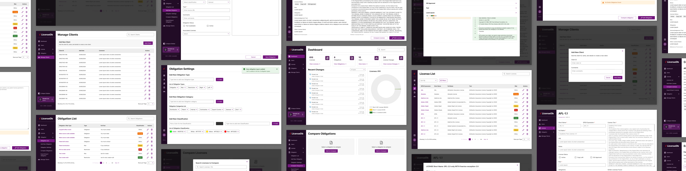
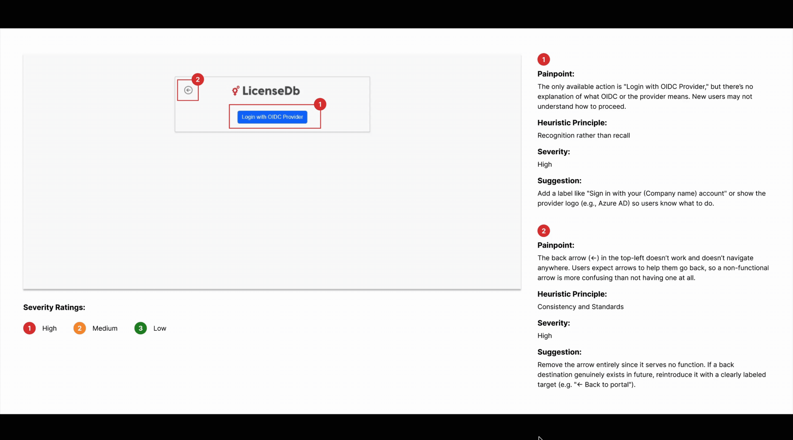
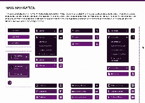

  

<h1>FOSSology & LicenseDb UX and UI design </h1>
<h2> <a href = "https://summerofcode.withgoogle.com/programs/2025/projects/gX6omKmk"> GSoC-2026 </a> @ <a href = "https://www.fossology.org/">FOSSology </a> </h2>

	<a href="#project-overview">Project Overview</a> | 
	<a href="#contributions">Contributions</a> | 
	<a href="#deliverables">Deliverables</a> | 
	<a href="#future-scope">Future Scope</a> | 
  <a href="#key-takeaways">Key Takeaways</a> | 
	<a href="#acknowledgements">Acknowledgements</a>

## Project Overview

My GSoC 2026 work was primarily centered around **LicenseDB**, with the aim of rethinking its interface and making its workflows clearer, more efficient, and easier to navigate. Once the LicenseDB redesign was completed, I worked on the remaining FOSSology pages that were left from my previous design work.

LicenseDB presents a different UX challenge from many of the FOSSology workflows I had worked on earlier. A large part of the interface revolves around managing and reviewing structured information licenses, obligations, users, clients, classifications, and historical changes along with long-form legal text. This made information hierarchy, discoverability, comparison, and the handling of dense data especially important.

My work covered the complete design process, starting with studying the existing product and identifying usability and accessibility concerns, followed by defining the key improvements and redesigning the required workflows. I also explored alternate states and edge cases instead of limiting the work to ideal-state screens. Throughout the project, the design system was expanded wherever LicenseDB introduced patterns that were not already covered.

The resulting work included a redesigned LicenseDB experience across its core workflows, completion of the remaining FOSSology screens, and an expanded set of reusable UI patterns that can support future design and development work.

 

## Contributions

### 1. Understanding and Auditing LicenseDB

Before redesigning the interface, I spent time understanding how LicenseDB was structured, what information it managed, and how different workflows connected to each other. I also looked at existing license and compliance products such as ScanCode LicenseDB, SPDX License List, FOSSA, and Choose a License to understand how similar products approach search, dense license information, review workflows, and license discovery.

The existing LicenseDB interface was then reviewed from two main perspectives: usability using **Jakob Nielsen's Heuristic Principles** and accessibility using **WCAG guidelines**. Rather than evaluating the interface only visually, I documented specific friction points, their severity, why they could create difficulty for users, and possible ways to resolve them.

The audit revealed recurring issues across the product. Large lists had limited ways to narrow information, some status indicators looked like interactive controls, terminology was not always immediately understandable, and several actions lacked enough context. Accessibility concerns such as contrast and dependence on color were also considered. For example, the existing classification experience sometimes required users to interpret colored indicators without sufficient labels or supporting information.

This audit became the reference point for the redesign: design decisions could be tied back to an observed usability problem instead of being made only for visual modernization.

  

### 2. Understanding Who LicenseDB Is Designed For

Since LicenseDB supports people with very different levels of licensing knowledge, I mapped its users into four broad groups: **License/Compliance Admins, Licensing Specialists, Developers, and Maintainers/Contributors**.

Their priorities differ considerably. An administrator may need to verify metadata and review compliance information, while a licensing specialist may need detailed terms, comparisons, exceptions, and historical information. Developers are more likely to prioritize quick discovery and understandable license information, whereas maintainers need efficient ways to create and update records.

Mapping these differences helped identify where the interface needed to provide depth without making every workflow equally complex. The research highlighted issues such as difficult license comparison, duplicated records, dense legal information, poor discoverability, complex navigation, and repetitive maintenance work.

From these findings, I defined the main priorities for the redesign: improve navigation, make large datasets easier to explore, strengthen hierarchy, make actions and system states clearer, simplify creation and editing flows, improve comparison, and establish consistent interaction patterns throughout LicenseDB.

### 3. Extending the FOSSology Design System for LicenseDB

The design system created for the FOSSology redesign was used as the foundation for LicenseDB. Core component specifications such as typography, spacing, sizing, buttons, form controls, tables, dropdowns, and interaction patterns were carried forward, while the visual styling was adapted to LicenseDB's identity. The most prominent change was the color system, which was updated around LicenseDB's purple palette along with supporting colors for risks, classifications, statuses, and feedback states.

The system was also expanded with components and patterns required by LicenseDB, including filtering, comparison, similarity results, navigation states, change history, and other product-specific interactions. This allowed LicenseDB and FOSSology to share the same underlying design foundations while retaining their individual visual identities.

  

#### Icons

The icon library created during the FOSSology redesign was reused wherever the same actions and concepts appeared in LicenseDB. Alongside these, additional custom icons were designed specifically for LicenseDB to represent its unique workflows and concepts while maintaining the same visual style and specifications as the existing icon set.

The new icons extended the shared library without creating a separate visual language, helping maintain consistency between FOSSology and LicenseDB while providing more relevant visual cues for LicenseDB-specific interactions.

**Pull Request**

- [LicenseDB Icons](LINK_TO_PULL_REQUEST)

### 4. Building the New LicenseDB Experience

The redesigned experience was developed around complete workflows rather than isolated screens. Along with the primary states, I designed interactions such as collapsed navigation, applied filters, confirmation dialogs, comparison states, similar-record detection, and expanded/collapsed change history.

#### Navigation and Dashboard

The navigation was redesigned to work in both expanded and collapsed states. When collapsed, users could still access the complete menu through an overlay, allowing more horizontal space to be dedicated to content without removing access to navigation.

The Dashboard was reorganized around the information users are most likely to need at a glance. Licenses, obligations, users, and license changes were surfaced as summary cards with direct links into the corresponding sections. Recent activity and license-risk information were also reorganized to make the page more useful as an entry point rather than simply a collection of statistics.

#### Users and Client Management

User and client administration were given a shared interaction model. Both areas use structured lists with clear primary actions, while creation is handled through focused modal dialogs.

For Users, the creation flow brings together username, display name, email, password, and access level. Manage Clients follows a similar pattern for client information. Reusing the interaction model across administrative areas makes these workflows easier to learn and avoids introducing different behavior for closely related tasks.

#### License Management

The License area required the most extensive set of designs. It covered the **License List, License Detail, Add License, Edit License, Delete License, and Compare Licenses** workflows.

The list experience was redesigned around faster exploration of a large dataset. Search was made easier to locate, sorting and filtering were introduced more clearly, active filters remained visible, and risk information was presented as a readable status rather than an ambiguous control.

Create and edit workflows were reorganized so that metadata, status information, obligations, acknowledgement text, and license text could be handled within a clearer hierarchy. I also designed a similar-license detection state that surfaces possible matches while the user is working with license text. Instead of requiring a contributor to manually leave the form and search for duplicates, relevant existing records can be brought into the current context.

License deletion was separated into a confirmation interaction to reduce accidental destructive actions.

The Compare Licenses experience addressed another recurring research finding: understanding differences between licenses can be difficult when information has to be inspected independently. The redesigned flow lets users select licenses and inspect their details side-by-side, while also supporting states where another license still needs to be added.

#### Obligation Management

Obligations were redesigned with a structure consistent with the License experience while accounting for their own metadata and workflows. The work included the **Obligation List, Obligation Detail, Add Obligation, and Edit Obligation** screens.

Information such as type, classification, category, status, assigned licenses, source information, and full text was reorganized to make the forms easier to scan. The add and edit experiences also include similar-obligation detection, bringing potentially related records into the workflow before a user completes an update or creates a duplicate.

#### Change History

I also designed a new way to inspect historical changes. Because change logs can become extremely detailed particularly when license text changes—the interface uses accordions to reveal information progressively.

Users can keep sections collapsed when they only need an overview or expand individual fields when they need the exact details. Text changes use a diff-style presentation so that previous and updated values can be compared more easily.

### 5. Completing the Remaining FOSSology Work

After completing the LicenseDB redesign, I focused on the remaining FOSSology pages that were not covered in the earlier redesign work. These screens followed the existing FOSSology design system, reusing established components and interaction patterns while introducing additional states or variations where required by the workflows.

This helped bring the remaining pages into the redesigned FOSSology experience while maintaining consistency across the product. It also expanded the coverage of the design system, ensuring that it could support a wider range of workflows without introducing unnecessary visual or interaction differences.

 

## Deliverables

| Deliverable | Status | Link |
| --- | --- | --- |
| Main Navigation | Completed | [Main Navigation pages on Figma](https://www.figma.com/design/6sB6F8cd9BwxUpVREfWj1j/License-Db-redesign?node-id=381-7894&t=1C61vGHfLq4q4Zjm-4) |
| Dashboard | Completed | [Dashboard pages on Figma](https://www.figma.com/design/6sB6F8cd9BwxUpVREfWj1j/License-Db-redesign?node-id=381-7893&t=1C61vGHfLq4q4Zjm-4) |
| User Pages | Completed | [User pages on Figma](https://www.figma.com/design/6sB6F8cd9BwxUpVREfWj1j/License-Db-redesign?node-id=381-7892&t=1C61vGHfLq4q4Zjm-4) |
| Manage Clients Pages | Completed | [Manage Clients pages on Figma](https://www.figma.com/design/6sB6F8cd9BwxUpVREfWj1j/License-Db-redesign?node-id=385-7895&t=1C61vGHfLq4q4Zjm-4) |
| License Pages | Completed | [License pages on Figma](https://www.figma.com/design/6sB6F8cd9BwxUpVREfWj1j/License-Db-redesign?node-id=385-7896&t=1C61vGHfLq4q4Zjm-4) |
| Obligation Pages | Completed | [Obligation pages on Figma](https://www.figma.com/design/6sB6F8cd9BwxUpVREfWj1j/License-Db-redesign?node-id=385-7897&t=1C61vGHfLq4q4Zjm-4) |
| Change Log Pages | Completed | [Change Log pages on Figma](https://www.figma.com/design/6sB6F8cd9BwxUpVREfWj1j/License-Db-redesign?node-id=385-7898&t=1C61vGHfLq4q4Zjm-4) |

 

## Future Scope

While the design work covered the planned workflows, there is still scope to evaluate how these decisions perform once they are used in the implemented product. A valuable next step would be structured usability testing with LicenseDB users, followed by iterations based on observed behavior rather than design review alone.

Implementation will also introduce opportunities to review accessibility in the actual interface, refine interactions that depend on real data, and verify how components behave across different screen sizes and content conditions. The design system can continue evolving alongside this work as new requirements appear across FOSSology and LicenseDB.

 

## Key Takeaways

- Designing LicenseDB gave me more experience working with interfaces where information architecture and data density are as important as visual design.

- I developed a better understanding of how heuristic evaluation can move beyond identifying problems and directly inform redesign priorities.

- Working with license and obligation information reinforced the importance of progressive disclosure showing enough information for a decision without overwhelming users with every detail at once.

- Designing similarity detection and comparison workflows made me think more deeply about bringing relevant information into the user's current context instead of requiring additional navigation.

- I became more intentional about designing alternate states and edge cases as part of the core workflow rather than treating them as additions after the main screen was finished.

- Extending previous design work into LicenseDB taught me how to preserve consistency across related products without forcing every product to use exactly the same solution.

- Working across both LicenseDB and FOSSology further strengthened my understanding of designing reusable components for products that continue to evolve through open-source contributions.

- Mentor and community feedback continued to be especially valuable for understanding domain-specific behavior that cannot always be inferred from the existing interface.

 

## Acknowledgements

I would like to thank my mentors and everyone in the FOSSology community who supported me throughout GSoC 2026. Their feedback helped me understand LicenseDB beyond what was visible in the interface from how its information is used to the edge cases and dependencies behind different workflows.

Returning to FOSSology for another GSoC also gave me the opportunity to approach this project with the context I had built previously while still working through a very different design problem. LicenseDB pushed me to think more deeply about dense information, administrative workflows, comparison, and designing for users with different levels of domain knowledge.

I am grateful to the FOSSology community and Google Summer of Code for the opportunity to continue contributing to open source and for another project that allowed me to learn through collaboration, iteration, and real product constraints.

 

## Reach Out to Me
- **GitHub:** [devxnshi](https://github.com/devxnshi)
- **LinkedIn:** [Devanshi Sachan](https://www.linkedin.com/in/devanshi-sachan-b26487235/)
- **GSoC 2025:** [FOSSology UX and UI Redesign](https://github.com/devxnshi/GSoC-2025)
